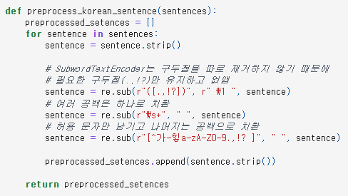
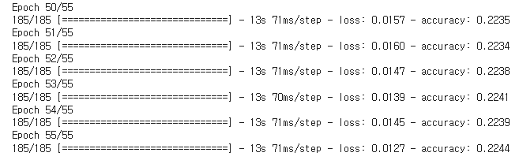
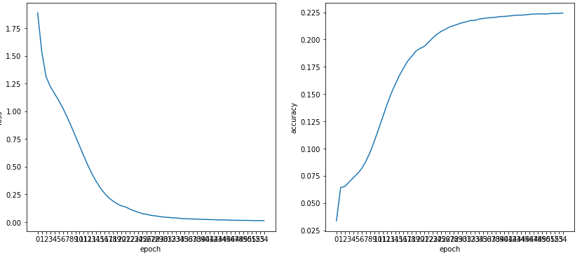
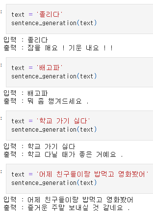
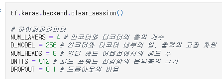
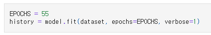

# AIFFEL Campus Online Code Peer Review Templete
- 코더 : 양지웅
- 리뷰어 : 김성훈


# PRT(Peer Review Template)
- [x]  **1. 주어진 문제를 해결하는 완성된 코드가 제출되었나요?**
    - 공백과 특수문자 처리, 토크나이징, 병렬데이터 구축의 과정이 적절히 진행되었다.
    - 

    - 구현한 트랜스포머 모델이 한국어 병렬 데이터 학습 시 안정적으로 수렴하였다.
    - 
    - 
     
    - 한국어 입력문장에 맥락에 맞는 한국어로 답변을 리턴하였다.
    - 
    
- [x]  **2. 전체 코드에서 가장 핵심적이거나 가장 복잡하고 이해하기 어려운 부분에 작성된 
주석 또는 doc string을 보고 해당 코드가 잘 이해되었나요?**
    - 레이어를 4개로 보다 깊게 쌓고, epoch수를 50까지 증가하여 성능 향상에 노력했다.
    - 
    - 
        
- [x]  **3. 에러가 난 부분을 디버깅하여 문제를 해결한 기록을 남겼거나
새로운 시도 또는 추가 실험을 수행해봤나요?**
    - 2번 문항 내용과 동일
        
- [x]  **4. 회고를 잘 작성했나요?**
    - 진행하면서 느꼈던 내용과 추가적으로 시도해볼 내용을 기록해두었다.
        
- [x]  **5. 코드가 간결하고 효율적인가요?**
    - 불필요한 반복이 생기지 않도록 모듈화 된 함수를 사용하며 간결한 코드로 작성되었다.


# 회고(참고 링크 및 코드 개선)
```
- 같은 고민을 했던 사람으로써 다른 방식으로 이를 풀어나가는 과정을 보는 것이 재미있고 유익했습니다.
- Vocab_Size는 상대적으로 적지만 샘플의 최대 길이가 길어진 부분은 단순하게 `SubwordTextEncoder`가 더 잘게 쪼개서 Vocab에 넣다보니 그렇게 된 것으로 추측했습니다.
    - 예시: "감기약이 여긴 없어", "감기 기운이 있어", "몸살 기운이 있어", "몸살약이 없어"
        - 더 잘게 쪼개는 경우: "감기", "약이", "여긴", "없어", "기운이", "몸살", "있어" -> Vocab 7 / 최대 길이 4 ("감기", "약이", "여긴", "없어")
        - 쪼개지 않고 사용하는 경우: "감기약이", "여긴", "없어", "감기", "기운이", "있어", "몸살", "몸살약이" -> Vocab 8 / 최대 길이 3 ("감기약이", "여긴", "없어")
    - 이 부분은 검증해보고 따로 공유드리겠습니다.
- 제가 해보지 못한 시도들을 보고 대리 경험할 수 있어서 좋은 시간이었습니다. 수고하셨습니다! :)
```
